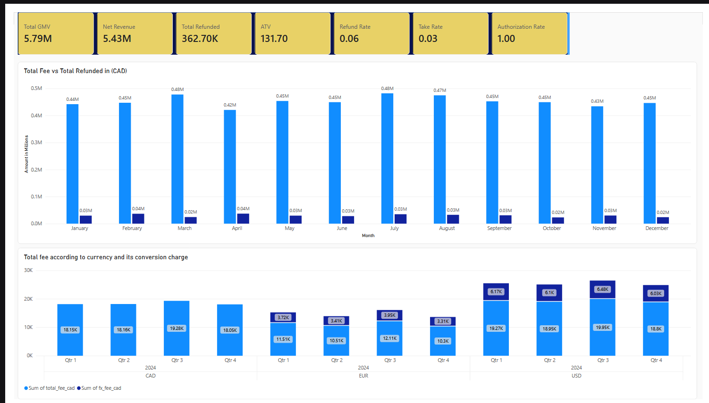
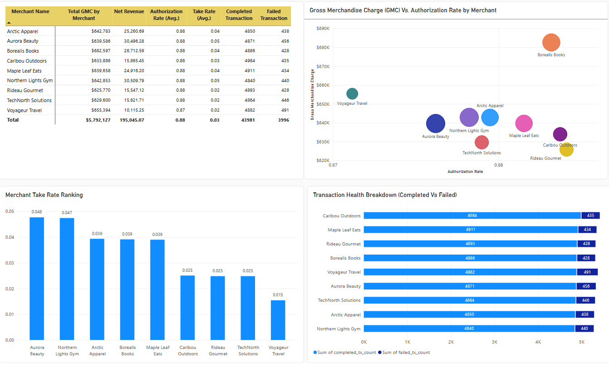

# 💳 Neo Analytics: FinTech Analytics Engineering Pipeline

[](https://github.com/ahirmitul8ca/Neo_Analytics/actions/workflows/dbt_ci.yml)

An end-to-end analytics engineering portfolio project for **NorthPay**, a fictional Canadian FinTech payment processor (synthetic data). It transforms raw payment, refund, merchant, and fee plan data into tested fact and aggregate models using dbt Core on Google BigQuery, defines core business metrics, enforces data quality with automated tests, and serves a Power BI dashboard on top.

---

## 📊 Executive Power BI Dashboard



<<<<<<< HEAD

=======


📄 [Full dashboard (PDF)](docs/Neo_Analytics_Dashboard.pdf)

<!-- After running `dbt docs generate && dbt docs serve`, screenshot the lineage graph to docs/lineage.png, then uncomment:

## 🧬 Data Lineage


-->
>>>>>>> 1c5f262 (fix: rename dashboard image file and update README link)

## 🛠 Tech Stack

| Component | Technology |
| :--- | :--- |
| **Data Warehouse** | Google Cloud BigQuery |
| **Transformation & Modeling** | dbt Core (`dbt-bigquery`) |
| **SQL Dialect** | BigQuery Standard SQL |
| **Data Ingestion** | dbt Seeds (CSV loaders) |
| **BI / Visualization** | Power BI |
| **CI** | GitHub Actions (`dbt build` on every push and pull request) |
| **Version Control** | Git & GitHub |

---

## 🚀 Quickstart

```bash
git clone https://github.com/ahirmitul8ca/Neo_Analytics.git
cd Neo_Analytics
python -m venv venv
venv\Scripts\activate          # macOS/Linux: source venv/bin/activate
pip install -r requirements.txt
gcloud auth application-default login
# configure ~/.dbt/profiles.yml (see GCP setup below)
dbt build                      # seeds + models + tests
dbt docs generate && dbt docs serve
```

---

## ☁️ Google BigQuery GCP Setup

Before running dbt commands, set up your Google Cloud Platform (GCP) environment and authenticate locally.

### 1. Create GCP Project & Dataset

- Log in to the [Google Cloud Console](https://console.cloud.google.com/).
- Create a new GCP project and note its Project ID.
- Navigate to **BigQuery** and click **Create Dataset**. Set the **Dataset ID** to `neoanalyticsdb` and **Data location** to `US`.

### 2. Install Google Cloud SDK & Authenticate

- Download and install the [Google Cloud SDK](https://cloud.google.com/sdk).
- Open your terminal inside your active Python virtual environment and run:

  ```bash
  gcloud auth application-default login
  ```

- Complete the OAuth browser prompt to authenticate your local machine.

### 3. Configure Local Profile (`~/.dbt/profiles.yml`)

- Create or open your local dbt profile at `~/.dbt/profiles.yml` (or `%USERPROFILE%\.dbt\profiles.yml` on Windows).
- Add the `neo_analytics` connection configuration:

  ```yaml
  neo_analytics:
    target: dev
    outputs:
      dev:
        type: bigquery
        method: oauth                    # Authenticates using gcloud ADC
        project: <your-gcp-project-id>   # Your GCP Project ID
        dataset: neoanalyticsdb          # Target BigQuery Dataset ID
        threads: 4
        location: US                     # BigQuery location region
  ```

---

## 📂 Project Structure

```text
Neo_Analytics/
├── .github/
│   └── workflows/
│       └── dbt_ci.yml             # GitHub Actions: dbt build on push / PR
├── ci/
│   └── profiles.yml               # dbt profile used by CI (isolated CI dataset)
├── docs/
│   ├── Dashboard.png
│   ├── Merchant_Performance.png
│   ├── Neo_Analytics_Dashboard.pdf
│   └── metrics.sql                # SQL definitions for core business metrics
├── macros/
│   ├── grant_select.sql           # Read-only access grants
│   └── log_tests_results.sql      # on-run-end test audit logging
├── models/
│   ├── marts/
│   │   ├── fct_payments.sql
│   │   └── merchant_performance.sql
│   ├── staging/
│   │   ├── stg_fee_plans.sql
│   │   ├── stg_merchants.sql
│   │   ├── stg_refunds.sql
│   │   └── stg_transactions.sql
│   └── schema.yml                 # Generic tests & column-level documentation
├── seeds/
│   ├── fee_plans.csv              # 4 fee structures
│   ├── merchants.csv              # 10 merchant records
│   ├── refunds.csv                # ~3,500 refund records
│   └── transactions.csv           # 50,000 payment attempts
├── tests/                         # Singular SQL business-logic tests
│   ├── assert_fx_fee.sql
│   ├── assert_no_refunds_on_failed_transactions.sql
│   ├── assert_refund_date_after_transaction_date.sql
│   ├── authorization_rate_bounds.sql
│   ├── cumulative_payment_refund_bounds.sql
│   └── monthly_fee_cap.sql
├── .gitignore
├── dbt_project.yml
├── README.md
└── requirements.txt
```

---

## 📐 Data Architecture & Modeling (Layered dbt Pattern)

```text
seeds (raw CSVs)  →  staging (views)  →  marts (tables)  →  Power BI
```

### 1. Seed / Raw Layer (`seeds/`)

Raw CSV files (`fee_plans.csv`, `merchants.csv`, `refunds.csv`, `transactions.csv`) are loaded into BigQuery using `dbt seed`.

### 2. Staging Layer (`models/staging/`, materialized as views)

The staging layer transforms raw source data into clean, standardized views:

- **Type Casting & Precision:** Enforces exact data types across key identifiers (`transaction_id`, `merchant_id`) and converts monetary fields into explicit numeric types to prevent floating-point rounding issues.
- **Timestamp Parsing:** Standardizes datetime strings into proper `TIMESTAMP` values.
- **Field Standardization:** Harmonizes field naming (`fixed_fee_cad` → `flat_fee_cad`), normalizes casing (`LOWER(status)`), and handles missing values via `COALESCE`.

### 3. Marts Layer (`models/marts/`, materialized as tables)

- **`fct_payments`**: Transaction-grain fact table built on completed transactions. Calculates payment processing fees, FX markup, net CAD volume, and associated refund metrics.
- **`merchant_performance`**: Monthly aggregate table summarizing volume, fee revenue, authorization rates, and refund counts per merchant. This is the primary source for the Power BI dashboard.

---

## 📊 Core Business Metrics (`docs/metrics.sql`)

All 6 core business metrics are defined and queryable in `docs/metrics.sql`:

| Metric | Business Definition | Calculation Logic |
| :--- | :--- | :--- |
| **Gross Merchandise Volume (GMV)** | Total completed payment volume in CAD | `SUM(amount_cad) WHERE status = 'completed'` |
| **Net Volume** | GMV minus refunded amounts (merchant volume retained after refunds) | `GMV - SUM(total_refunded_cad)` |
| **Refund Rate** | Share of completed transactions with at least one refund | `COUNT(DISTINCT refunded transaction_id) / COUNT(completed transactions)` |
| **Average Transaction Value (ATV)** | Average order value per completed transaction | `GMV / COUNT(completed transactions)` |
| **Authorization Rate** | Approval rate across all payment attempts | `COUNT(completed) / (COUNT(completed) + COUNT(failed))` |
| **Take Rate** | Fee revenue captured relative to GMV (NorthPay's revenue metric) | `SUM(total_fees_cad) / GMV` |

> **Note:** NorthPay's revenue is the fees it charges (see Take Rate). Net Volume measures merchant money moved after refunds, not NorthPay revenue.

---

## 🧪 Data Quality & Custom Test Suite

The pipeline runs generic schema tests (defined in `models/schema.yml`) and 6 custom singular SQL business-logic assertions in `tests/`. All tests run on every push and pull request through GitHub Actions.

1. **`assert_fx_fee.sql`**: Validates foreign exchange fee calculations on non-CAD transactions.
2. **`assert_no_refunds_on_failed_transactions.sql`**: Confirms no refund records are associated with failed transaction attempts.
3. **`assert_refund_date_after_transaction_date.sql`**: Ensures refund timestamps occur after the original transaction creation dates.
4. **`authorization_rate_bounds.sql`**: Verifies authorization rates stay within 0% to 100%.
5. **`cumulative_payment_refund_bounds.sql`**: Asserts cumulative refund amounts do not exceed the original transaction values.
6. **`monthly_fee_cap.sql`**: Validates monthly tier caps on fee structures.

---

## 🧩 Custom dbt Macros (`macros/`)

Custom Jinja/SQL macros handle database permissions, access governance, and audit logging in Google BigQuery.

### 1. `log_tests_results.sql` (macro `log_test_results`): Automated Test Audit Logging

An `on-run-end` hook macro that captures execution metadata across generic schema tests and singular custom SQL tests, and logs audit records into a dedicated BigQuery dataset.

**Functionality:**

- Filters execution results to node resource types matching `test`.
- Dynamically targets the destination project (`{{ target.project }}`) and dataset (`{{ target.schema }}_dbt_test_audit`) based on the active target profile.
- Creates the table `audit_test_history` if it does not already exist.
- Inserts records capturing `test_name`, `model_tested`, `status` (pass/fail/warn), `execution_time_seconds`, `failures_detected`, `test_type`, and `executed_at`.

**Project configuration (`dbt_project.yml`)**, triggered automatically after each run:

```yaml
on-run-end:
  - "{{ log_test_results(results) }}"
```

### 2. `grant_select.sql`: Access Control & Governance

An operational macro that automates dataset-level read permissions for downstream users and teams.

**How it works:**

- **Default values:** Uses the active target schema (`target.schema`) and defaults to BigQuery's `roles/bigquery.dataViewer` role.
- **Automated DDL:** Builds and executes dynamic SQL `GRANT` statements giving read-only viewer privileges to a configured group (the repo uses the placeholder `analytics-team@example.com`; replace it with your own group).

**CLI usage:**

Default execution (grants viewer access on the current target schema):

```bash
dbt run-operation grant_select
```

Passing dynamic arguments (override target dataset or role):

```bash
dbt run-operation grant_select --args "{schema: 'neoanalyticsdb', role: 'roles/bigquery.dataViewer'}"
```